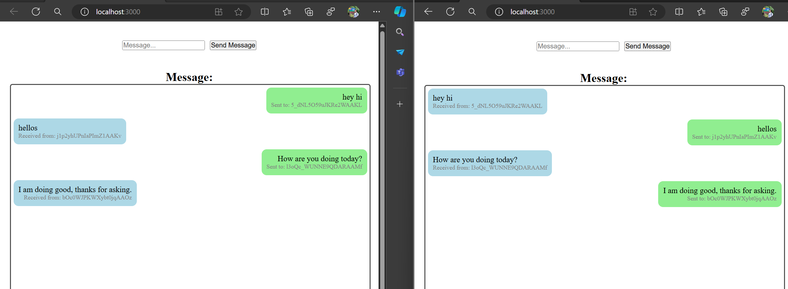

# Overview:
This sample demonstrates the working of a real-time chat app using websockets. The server and the client utlizes the socket.io library to connect to each other and exchanges the messages in realtime.

## How to use this sample.
- Clone the repo.
- Run `npm install` on both the server and client projects, to make sure all required dependencies are install.
- Run the server application using the command `npm run start` or `npm run start-dev` (to start the app in development mode).
- Run the client application using the command `npm start`

### Note:
1: The server application is an Express Nodejs server running on port 3001 (http://localhost:3001).
2: The client application is a ReactJS app running on port 3000 (http://localhost:3000).